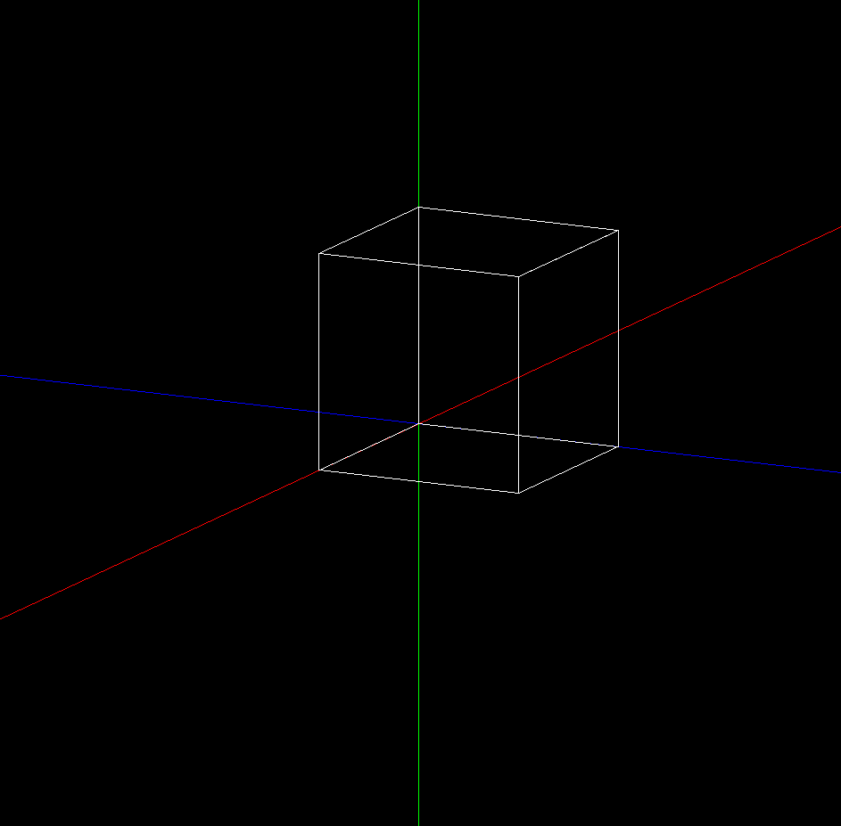
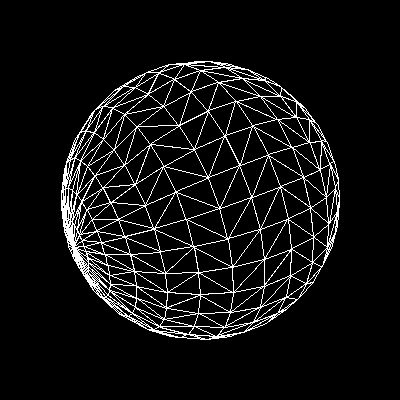

# What is this?

This is a project that I'm using to learn the basics of computer graphics.
I thought trying to write a program that could render basic shapes would be a good start to getting a grasp on the math.
(i still haven't taken linear algebra)

# Features
Some features of this 3D rendering engine

## OBJ Support

Complex objects can be loaded in from .obj files!

## Back Face Culling

You can see here the back faces are rendered (to show that they are usually taken out), unlike the example above